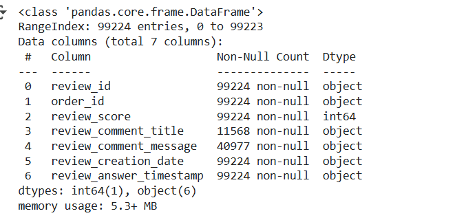
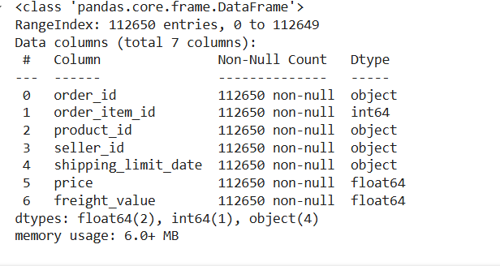
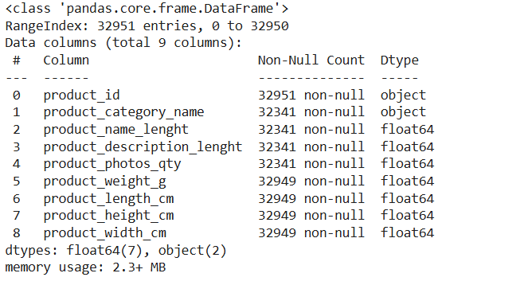
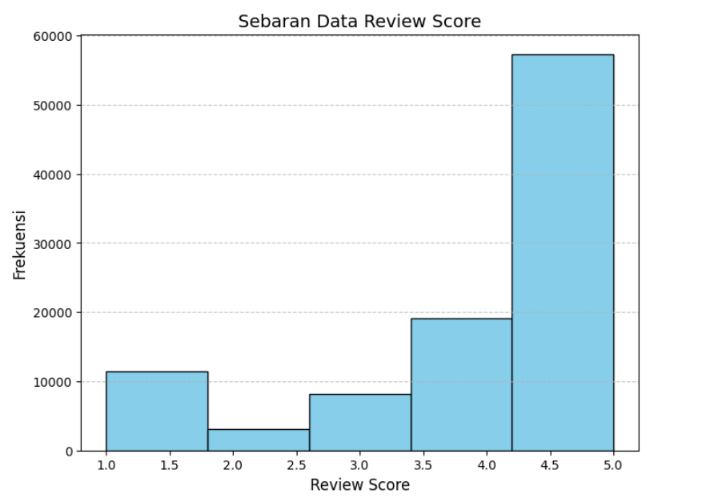
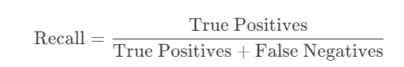
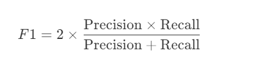
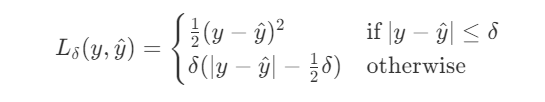

# Laporan Proyek Machine Learning - Muhammad Reza Al Fatah

## Domain Proyek
---
Berikut adalah penulisan dengan format markdown:

---

Platform e-commerce semakin berkembang pesat dengan banyaknya produk yang ditawarkan dan pengunjung yang datang. Salah satu tantangan utama adalah memberikan pengalaman berbelanja yang personal dan relevan bagi setiap pengguna. Dengan sistem rekomendasi yang tepat, platform e-commerce dapat meningkatkan penjualan, kepuasan pengguna, dan retensi pelanggan. Berdasarkan penelitian yang dilakukan oleh Putra, sistem rekomendasi berbasis konten dan kolaboratif dapat meningkatkan relevansi rekomendasi produk pada e-commerce dengan mempertimbangkan baik preferensi pengguna maupun interaksi pengguna lainnya [^1].

Proyek ini bertujuan untuk mengembangkan sistem rekomendasi yang memadukan dua pendekatan utama, rekomendasi berbasis konten dan rekomendasi kolaboratif, untuk memberikan saran produk yang lebih relevan dan personal kepada setiap pengguna, berdasarkan preferensi mereka dan perilaku pengguna lainnya. Hal ini didukung oleh temuan dari penelitian yang menunjukkan bahwa kombinasi kedua metode tersebut mampu meningkatkan pengalaman pengguna dalam berbelanja secara online [^2].

## Business Understanding
---

### Problem Statements

- Bagaimana merekomendasikan produk kepada pengguna berdasarkan kemiripan dengan barang yang dibelinya.
- Bagaimana merekomendasikan produk kepada pengguna berdasarkan kemiripan antara pengguna.

### Goals

-  Membangun model rekomendasi produk berbasis konten menggunakan algoritma TF-IDF (Term Frequency-Inverse Document Frequency) dan Cosine Similarity untuk merekomendasikan produk kepada pengguna berdasarkan kemiripan deskripsi produk yang telah dibeli dengan produk lainnya.

- Membangun model rekomendasi kolaboratif menggunakan teknik  Neural Collaborative Filtering untuk merekomendasikan produk kepada pengguna berdasarkan pola perilaku pengguna lain. Model ini akan dilatih dengan data interaksi pengguna  untuk memahami preferensi yang serupa antar pengguna dan memberikan rekomendasi yang relevan berdasarkan kemiripan preferensi tersebut.

### sulustion
### Solusi

#### 1. **Rekomendasi Berdasarkan Kemiripan Produk (Content-Based Filtering)**

Untuk merekomendasikan produk berdasarkan kemiripan deskripsi produk yang telah dibeli oleh pengguna dengan produk lainnya, kita bisa menggunakan algoritma **TF-IDF** dan **Cosine Similarity**. Berikut langkah-langkah solusinya:

- **Preprocessing Data**: Mengolah teks deskripsi produk dengan membersihkan teks, menghapus stop words, dan melakukan stemming jika perlu.
- **Menghitung TF-IDF**: Menggunakan teknik TF-IDF untuk menghitung pentingnya setiap kata dalam deskripsi produk dibandingkan dengan seluruh korpus deskripsi produk.
- **Membangun Matriks Kosinus**: Setelah menghitung TF-IDF, kita bisa menghitung **Cosine Similarity** antara produk yang dibeli oleh pengguna dengan produk lain yang ada di dalam katalog. Cosine Similarity mengukur sejauh mana dua vektor (representasi produk) memiliki kesamaan.
- **Rekomendasi**: Berdasarkan nilai cosine similarity yang tinggi, kita bisa memberikan rekomendasi produk yang mirip dengan produk yang telah dibeli oleh pengguna.

#### 2. **Rekomendasi Berdasarkan Kemiripan Pengguna (Collaborative Filtering)**

Untuk merekomendasikan produk berdasarkan kemiripan antar pengguna, kita bisa menggunakan **Neural Collaborative Filtering**. Berikut langkah-langkah solusinya:

- **Persiapan Data Interaksi Pengguna**: Mengumpulkan data interaksi pengguna dengan produk, misalnya rating atau pembelian yang dilakukan oleh pengguna.
- **Model Neural Collaborative Filtering**: Membangun model neural network yang terdiri dari dua bagian utama, yaitu:
  - **User Embedding**: Representasi vektor dari pengguna yang memetakan pengguna ke dalam ruang vektor berdasarkan interaksi mereka dengan produk.
  - **Item Embedding**: Representasi vektor dari produk yang memetakan produk ke dalam ruang vektor berdasarkan interaksi mereka dengan pengguna.
- **Pelatihan Model**: Melatih model dengan data interaksi pengguna untuk mempelajari preferensi dan pola perilaku pengguna. Model ini menggunakan teknik seperti **Matrix Factorization** untuk mengidentifikasi hubungan antara pengguna dan produk.
- **Prediksi dan Rekomendasi**: Model ini akan memberikan rekomendasi produk berdasarkan preferensi yang dipelajari dari pola perilaku pengguna yang serupa.

## Data Understanding
---
Data yang digunakan berasal dari Kaggle dapat didownload di link berikut https://www.kaggle.com/datasets/olistbr/brazilian-ecommerce

### Informasi  dataset yang digunakan:

dataset memilki 99441 baris dan 4 fitur dan tidak memilki nilai nan 
### 1.  olist_customers_dataset.csv 

### Variabel Pada olist_customers_dataset
- customer_id: digunakan untuk mencatat transaksi atau interaksi pelanggan dalam platform tertentu bersifat unik untuk setiap Transaksi satu id menadakan 1 transaksi,

- customer_unique_id: digunakan untuk mendapatkan informasi pelanggan yang konsisten dari berbagai platform yang berbeda bersifat unik 1 id  menadakan 1 user .

- customer_zip_code_prefix: Ini adalah kode pos atau awalan kode pos pelanggan. Biasanya, kode pos ini digunakan untuk mengidentifikasi area geografis atau lokasi pelanggan. Awalan kode pos ini bisa merujuk pada wilayah atau kota tertentu.

- customer_city: Ini adalah nama kota tempat pelanggan berada. Misalnya, dalam data ini ada kota-kota seperti "franca", "sao bernardo do campo", dan lainnya.

- customer_state: Ini adalah nama negara bagian atau provinsi tempat pelanggan berada. Pada dataset ini, semuanya berada di negara bagian SP (São Paulo) di Brasil.

###  2. olist_orders_dataset.csv:

dataset memilki 99441 baris dan 7 fitur dan  memilki nilai nan 
### Variabel olist_orders_dataset.csv
- order_id: Merupakan ID unik yang mengidentifikasi setiap pesanan yang dilakukan oleh pelanggan.

- customer_id: Merupakan ID unik yang mengidentifikasi setiap pelanggan yang melakukan pembelian.

- order_status: Status dari pesanan, misalnya "delivered" menunjukkan bahwa pesanan telah berhasil dikirimkan kepada pelanggan.

- order_purchase_timestamp: Waktu dan tanggal ketika pesanan dibuat oleh pelanggan.

- order_approved_at: Waktu dan tanggal ketika pesanan disetujui oleh sistem atau pihak yang berwenang (misalnya sistem pembayaran atau verifikasi).

- order_delivered_carrier_date: Tanggal dan waktu ketika pesanan diserahkan kepada pihak pengiriman atau kurir.

- order_delivered_customer_date: Tanggal dan waktu ketika pesanan diterima oleh pelanggan setelah proses pengiriman.

- order_estimated_delivery_date: Tanggal perkiraan kapan pesanan akan sampai ke pelanggan (dalam banyak kasus, ini adalah estimasi pengiriman yang disediakan oleh sistem atau kurir

### 3. olist_order_reviews_dataset.csv:

dataser memiliki 99224 baris dan 6 fitur
### Variabel olist_orders_reviews_dataset.csv
- review_id: ID unik yang mengidentifikasi setiap ulasan yang diberikan oleh pelanggan.

- order_id: ID pesanan yang terkait dengan ulasan tersebut. Ini menghubungkan ulasan dengan pesanan yang dibeli.

- review_score: Skor yang diberikan oleh pelanggan untuk produk yang dibeli. Skor ini biasanya dalam bentuk angka, misalnya dari 1 hingga 5, untuk menunjukkan tingkat kepuasan pelanggan terhadap produk.

- review_comment_title: Judul dari ulasan yang diberikan. Biasanya ini adalah ringkasan atau headline yang menggambarkan pendapat umum pelanggan tentang produk.

- review_comment_message: Pesan atau deskripsi lengkap dari ulasan yang diberikan oleh pelanggan. Bagian ini memberikan detail lebih lanjut tentang pengalaman mereka dengan produk.

- review_creation_date: Tanggal dan waktu saat ulasan dibuat oleh pelanggan. Ini memberi informasi kapan pelanggan memberikan feedback terhadap produk.

- review_answer_timestamp: Tanggal dan waktu ketika ulasan dijawab oleh pihak penjual atau sistem. Ini menunjukkan kapan ulasan tersebut mendapatkan respons (jika ada).

### 4. olist_order_items_dataset.csv:

dataset ini memilki 112650 baris dan 7 fitur
### Variabel olist_order_items_dataset.csv
- order_id: ID unik yang mengidentifikasi pesanan. Ini menghubungkan item yang dibeli dalam satu transaksi atau pesanan.

- order_item_id: ID unik untuk setiap item dalam pesanan. Dalam satu pesanan bisa ada lebih dari satu item, dan ID ini mengidentifikasi item spesifik.

-  product_id: ID unik yang mengidentifikasi produk yang dibeli. Ini merujuk pada produk spesifik yang dipesan dalam transaksi tersebut.

- seller_id: ID unik yang mengidentifikasi penjual produk tersebut. Setiap penjual memiliki ID yang berbeda untuk membedakan mereka dalam sistem.

- shipping_limit_date: Tanggal dan waktu batas akhir untuk pengiriman produk, yang menunjukkan kapan penjual harus mengirimkan barang tersebut kepada pelanggan.

- price: Harga produk yang dibeli, biasanya dalam mata uang tertentu. Ini adalah biaya dasar produk tanpa mempertimbangkan biaya pengiriman.

- freight_value: Biaya pengiriman yang dikenakan untuk produk tersebut. Ini adalah biaya tambahan untuk pengiriman barang kepada pelanggan, yang dapat bervariasi berdasarkan lokasi pengiriman, berat produk, dan lainnya.

### 5. olist_products_dataset.csv:

dataset memilki 32951 baris dan 9 fitur
### olist_products_dataset.csv
- customer_id: ID unik untuk masing-masing pelanggan. Ini digunakan untuk mengidentifikasi pelanggan dalam sistem.

- customer_unique_id: ID pelanggan yang lebih permanen dan unik di seluruh sistem, yang memungkinkan identifikasi pelanggan meskipun mereka melakukan pembelian dengan beberapa akun.

- customer_city: Kota tempat tinggal pelanggan, yang memberikan informasi mengenai lokasi geografis pelanggan.

- order_id: ID unik untuk setiap pesanan. Ini digunakan untuk mengidentifikasi pesanan tertentu dalam sistem.

- order_status: Status pesanan, misalnya "delivered", yang menunjukkan apakah pesanan telah berhasil dikirimkan dan diterima oleh pelanggan.

- review_id: ID unik untuk setiap ulasan yang diberikan oleh pelanggan. Ini digunakan untuk mengidentifikasi ulasan yang terkait dengan produk atau pesanan.

- review_score: Skor ulasan yang diberikan oleh pelanggan untuk produk tersebut, biasanya dalam skala 1-5. Ini memberi gambaran tentang kepuasan pelanggan terhadap produk yang dibeli.

- order_item_id: ID unik untuk setiap item yang dipesan dalam satu pesanan. Ini digunakan untuk mengidentifikasi item spesifik dalam pesanan yang lebih besar.

- product_id: ID unik untuk produk yang dipesan. Ini mengidentifikasi produk tertentu yang dibeli oleh pelanggan.

- price: Harga produk sebelum biaya pengiriman. Ini memberikan informasi mengenai harga produk yang dipesan.

- freight_value: Biaya pengiriman yang dikenakan untuk pesanan produk. Ini adalah biaya yang dibebankan kepada pelanggan untuk pengiriman barang.

- total_value: Total nilai pesanan, yang merupakan jumlah dari harga produk dan biaya pengiriman. Ini menunjukkan biaya total yang dibayar pelanggan untuk produk dan pengiriman.

- product_category_name: Nama kategori produk, seperti "moveis_escritorio" (furniture kantor) atau "utilidades_domesticas" (peralatan rumah tangga). Ini mengelompokkan produk berdasarkan jenisnya.

- product_weight_g: Berat produk dalam gram. Ini menunjukkan berat produk yang dipesan.

- product_length_cm: Panjang produk dalam sentimeter. Ini menunjukkan dimensi panjang produk.

- product_height_cm: Tinggi produk dalam sentimeter. Ini menunjukkan dimensi tinggi produk.

- product_width_cm: Lebar produk dalam sentimeter. Ini menunjukkan dimensi lebar produk.

### Exploratory Data Analysis

- melakukan visaulisasi disrtibusi data pada review score dari datafarme olist_order_reviews_dataset

insight: data dengan ferkuensi terbayak pada  bintang 5 dan yang terendah pada bintang 2

- melakukan visualisasi distribusi data pada variabel Freight pada dataframe olist_order_items_dataset

insght: distribusi data cenderung normal memilki ferkuensi yang hampir sama tetapi sedikit di dominasi afternoon dan fequensi kelas night menjadi kelas ferquensi terendah

## Data Preparation

### **- Menghapus Kolom yang Kurang Relevan**

### Deskripsi

Dalam analisis data untuk sistem rekomendasi, tidak semua kolom dalam dataset memiliki nilai yang signifikan terhadap tujuan prediksi. Oleh karena itu, beberapa kolom yang kurang relevan perlu dihapus untuk meningkatkan akurasi dan efisiensi model rekomendasi.

### Proses Penghapusan Kolom

Berikut adalah beberapa dataset yang mengalami proses penghapusan kolom yang dianggap kurang relevan:

### 1. olist_customers_dataset
Kolom yang dihapus: 'customer_state', 'customer_zip_code_prefix'

### Alasan:
 Informasi geografis ini tidak secara langsung berkontribusi dalam sistem rekomendasi berbasis transaksi.

### 2. olist_order_reviews_dataset

Kolom yang dihapus: 'review_comment_title', 'review_comment_message', 'review_creation_date', 'review_answer_timestamp'

### Alasan: 
Data teks ini bisa jadi tidak terlalu berpengaruh dalam model rekomendasi yang lebih mengandalkan skor ulasan daripada isi komentar.

### 3. olist_order_items_dataset

Kolom yang dihapus: 'seller_id', 'shipping_limit_date'

### Alasan:
 Informasi penjual dan batas waktu pengiriman tidak memberikan nilai tambah dalam sistem rekomendasi produk.

### 4. olist_products_dataset

Kolom yang dihapus: 'product_photos_qty', 'product_description_lenght', 'product_name_lenght'

### Alasan: 
Detail deskripsi dan jumlah foto produk tidak terlalu relevan untuk analisis rekomendasi berbasis pola pembelian.

### 5. orders dataset
Kolom yang dihapus: 'order_purchase_timestamp', 'order_approved_at', 'order_delivered_carrier_date', 'order_delivered_customer_date', 'order_estimated_delivery_date'

### Alasan: 
Informasi waktu pemrosesan pesanan tidak terlalu relevan dalam menentukan rekomendasi produk kepada pelanggan.

### **-  Mengatasi  Missing Value (NaN)**
- **Proses**:  
 Menghapus nilai yang hilang pada masing-masing DataFrame

### Alasan:

Missing value dapat menghambat algoritma machine learning karena sebagian besar algoritma tidak dapat menangani data yang kosong.
Alasan menghapus data tersebut adalah karena jumlah nilai NaN tidak terlalu banyak, sehingga penghapusan tidak akan menyebabkan kehilangan banyak informasi.

### **-  Mengatasi nilai duplikat untuk id user**
- **Proses**:  
  mengahpus id user yang duplikat 
- **Alasan**:  
  - id user adalah nilai yang pasti unik karena akan selalu ada id baru setiap transaksu

### **- Menggabungkan Semua DataFrame Menjadi Satu**  

- **Proses**:  
  - Menggunakan metode **`merge()`** pada pandas untuk menggabungkanDataFrame menjadi satu berdasarkan kolom yang memiliki hubungan antar tabel.  
- **Alasan**:  
  - Menggabungkan data dari berbagai sumber ke dalam satu DataFrame mempermudah analisis dan pemrosesan lebih lanjut.  
  - Memastikan semua informasi yang relevan tersedia dalam satu struktur data, sehingga dapat digunakan dalam model machine learning atau analisis eksplorasi.  
  - Mengurangi kompleksitas dalam pengolahan data dengan menghindari pemrosesan terpisah pada beberapa DataFrame.

### - **Membuat Sampel Data**  

- **Proses**:  
  - Menggunakan metode **`sample()`** pada pandas untuk mengambil sebagian kecil data dari DataFrame utama.  

- **Alasan**:  
  - Mengatasi keterbatasan memori saat melakukan **Cosine Similarity**, karena perhitungan pada dataset yang besar dapat memakan banyak sumber daya komputasi.  
  - Mempercepat proses komputasi dengan mengurangi jumlah perhitungan jarak antar vektor.  
  - Jika dataset terlalu besar, pemrosesan dapat menjadi lambat atau bahkan gagal karena kehabisan memori.  
  - Dengan mengambil sampel, kita masih dapat memperoleh representasi data yang cukup baik tanpa harus memproses seluruh dataset.

### - **Memelih fitur untuk rekomedasi contenbase** 
 
- **Proses**:  menggunakan Fitur kategorikal: product_category_name (jenis produk).
Fitur numerik: product_weight_g, product_length_cm, product_height_cm, product_width_cm. Menggunakan TF-IDF untuk Fitur Kategorikal

TfidfVectorizer(stop_words='english') digunakan untuk mengubah product_category_name menjadi representasi numerik berdasarkan frekuensi kata. Normalisasi Fitur Numerik dengan StandardScaler

StandardScaler() digunakan untuk menstandarisasi fitur numerik agar memiliki mean = 0 dan standar deviasi = 1.
### alasan :
- Fitur Kategorikal (product_category_name): Memilih kategori produk sebagai fitur penting karena ini menggambarkan jenis produk yang dapat digunakan untuk menemukan produk serupa. TF-IDF digunakan untuk menghitung bobot kategori dan menyingkirkan kata-kata umum yang tidak berguna.
- Fitur Numerik (product_weight_g, product_length_cm, product_height_cm, product_width_cm): Fitur-fitur ini memberikan informasi terkait karakteristik fisik produk. Dalam rekomendasi content-based, fitur numerik membantu menentukan kesamaan produk berdasarkan atribut fisiknya.
Penggunaan TF-IDF untuk Fitur Kategorikal: TF-IDF membantu mengubah data kategorikal menjadi representasi numerik yang lebih bermakna dengan menilai pentingnya masing-masing kategori. Ini juga membantu mengurangi dampak kata-kata umum atau stop words dalam kategori produk yang mungkin tidak relevan.
- Normalisasi dengan StandardScaler: Normalisasi penting untuk memastikan bahwa fitur numerik memiliki skala yang seragam, mencegah fitur dengan rentang nilai yang lebih besar mendominasi perhitungan similarity. Hal ini memungkinkan model untuk mempertimbangkan setiap fitur dengan adil saat menghitung kesamaan antar produk. 

### **- Memelih fitur untuk rekomedasi Colaborative**
- **Proses**:  
  Pemilihan Fitur: Fitur yang digunakan meliputi price, freight_value, dan total_value untuk representasi data produk. review_score digunakan sebagai target variabel (nilai ulasan), sementara customer_unique_id dan product_category_name digunakan sebagai identifikasi pengguna dan produk..  
- **Alasan**:  
  - price (harga): Harga adalah faktor utama yang dipertimbangkan oleh banyak pengguna dalam memilih produk. Dengan memasukkan harga, sistem dapat memahami preferensi pengguna terkait produk dengan harga tertentu dan memberikan rekomendasi berdasarkan kecocokan harga.

- freight_value (biaya pengiriman): Biaya pengiriman adalah aspek penting yang mempengaruhi keputusan pembelian. Pengguna sering kali memperhitungkan biaya pengiriman saat membuat keputusan, sehingga memanfaatkan fitur ini dapat meningkatkan kualitas rekomendasi dengan memperhitungkan preferensi pengguna terhadap biaya tambahan.

- total_value (total nilai): Total nilai mencerminkan nilai keseluruhan dari transaksi, yang dapat membantu sistem mengenali produk yang sering dibeli bersama atau memiliki nilai transaksi yang lebih tinggi. Ini memberikan wawasan tentang kecenderungan pembelian pengguna.

- review_score (nilai ulasan): Ulasan produk sering kali mencerminkan kualitas produk menurut pengalaman pengguna sebelumnya. Menggunakan review_score sebagai variabel target membantu sistem merekomendasikan produk yang lebih berkualitas atau populer berdasarkan feedback dari pengguna lain.

- customer_unique_id (ID pengguna unik): ID pengguna ini membantu sistem mengenali preferensi setiap pengguna secara individu, memungkinkan rekomendasi yang lebih disesuaikan dengan riwayat pembelian atau interaksi sebelumnya dari pengguna tertentu.

- product_category_name (kategori produk): Kategori produk memungkinkan untuk mengelompokkan produk berdasarkan jenis atau kategori yang relevan, sehingga sistem dapat memberikan rekomendasi yang lebih relevan berdasarkan kesamaan kategori produk yang diminati oleh pengguna.

### **-  Train/Test Split untuk membagun model colobarative**
- **Proses**:  
  Dataset dibagi menjadi **data latih** (80%) dan **data uji** (20%).  
- **Alasan**:  
  - Data latih digunakan untuk melatih model, sedangkan data uji digunakan untuk mengevaluasi performa model pada data yang tidak terlihat sebelumnya.  
  - Membantu mendeteksi overfitting atau underfitting.  

## Modeling

### Model yang digunakan untuk Conten Base
Modeling yang digunakan dalam kode ini memanfaatkan teknik **TF-IDF (Term Frequency - Inverse Document Frequency)** dan **Cosine Similarity** untuk mengukur kedekatan antar produk berdasarkan kombinasi fitur kategorikal dan numerik. Berikut adalah penjelasan dari masing-masing bagian dan parameter yang digunakan:

### 1. **TF-IDF (Term Frequency - Inverse Document Frequency)**

TF-IDF digunakan untuk mengubah fitur teks (dalam hal ini, kategori produk) menjadi representasi numerik. Fitur ini memberikan bobot yang lebih tinggi pada kata-kata yang jarang muncul dalam seluruh dataset tetapi sering muncul dalam dokumen tertentu. Dengan cara ini, TF-IDF meminimalkan pengaruh kata-kata umum yang tidak memiliki banyak informasi.

**1. Parameter penting untuk TF-IDF:**

- **`max_features`**: Dapat digunakan untuk membatasi jumlah kata yang dihasilkan oleh TF-IDF.

### 2. **Normalisasi Fitur Numerik**

Fitur numerik seperti **`product_weight_g`**, **`product_length_cm`**, **`product_height_cm`**, dan **`product_width_cm`** dinormalisasi menggunakan **`StandardScaler`** untuk memastikan bahwa setiap fitur memiliki skala yang sama. Ini penting karena fitur numerik ini bisa memiliki rentang yang sangat berbeda, dan beberapa metode pembelajaran mesin (termasuk cosine similarity) lebih sensitif terhadap skala.

**Langkah-langkah  yang di lakukan**
- **`StandardScaler()`**: Menstandarkan data dengan mengubah nilai menjadi distribusi dengan rata-rata 0 dan standar deviasi 1.
- **`fit_transform()`**: Menghitung rata-rata dan deviasi standar dari data dan kemudian menstandarkan data berdasarkan nilai tersebut.

**Parameter penting untuk StandardScaler:**
- **`with_mean`**: Jika `True`, data akan diubah dengan mengurangi rata-rata.
- **`with_std`**: Jika `True`, data akan dibagi dengan deviasi standar.

### 3. **Menggabungkan TF-IDF dan Fitur Numerik**

Setelah kedua jenis fitur (kategorikal dan numerik) diproses secara terpisah, hasilnya digabungkan menggunakan **`hstack`** untuk membentuk satu vektor fitur yang menyatukan informasi dari kedua sumber tersebut.

**Langkah-langkah  yang dilakukan:**
- **`hstack([category_tfidf, numeric_data])`**: Menggabungkan hasil transformasi TF-IDF dan data numerik yang sudah dinormalisasi ke dalam satu matriks fitur.

### 4. **Cosine Similarity**

Cosine Similarity digunakan untuk mengukur seberapa mirip dua produk berdasarkan vektor fitur yang telah digabungkan. Cosine similarity mengukur kedekatan dua vektor dengan menghitung sudut antara keduanya. Nilai cosine similarity berkisar antara -1 hingga 1, di mana 1 berarti dua vektor identik (sangat mirip), dan 0 berarti tidak ada kesamaan.

**Langkah-langkah yang dilakukan**
- **`cosine_similarity(features_combined)`**: Menghitung cosine similarity antara setiap pasangan produk berdasarkan kombinasi fitur yang sudah diproses.

  
### Model dengan Colaborative
Model Collaborative Filtering adalah pendekatan dalam sistem rekomendasi yang berfokus pada interaksi antara pengguna dan produk, bukan pada konten atau fitur spesifik dari produk tersebut. Tujuannya adalah untuk memprediksi preferensi pengguna terhadap produk berdasarkan pola interaksi mereka dengan produk lain yang serupa.

### Parameter yang Diperlukan dalam membagun model Collaborative :
- melakukan Matrix Factorization:
Tujuan dari matrix factorization adalah untuk memecah matriks interaksi besar menjadi dua matriks yang lebih kecil: matriks user embedding dan product embedding. Kedua matriks ini akan menyimpan informasi tersembunyi yang mewakili fitur laten dari pengguna dan produk.

- Embedding Dimensi (embedding_dim):
Dimensi dari vektor embedding yang menentukan ukuran representasi laten. Memilih dimensi yang tepat penting untuk keseimbangan antara kinerja dan kompleksitas.
Ukuran Input:

- input_dim pada embedding harus sesuai dengan jumlah unik pengguna dan produk. Ini memberi tahu model berapa banyak entitas yang perlu diproses.
- Dot Product:
Digunakan untuk menghitung interaksi antar pengguna dan produk berdasarkan vektor embedding mereka.
- Loss Function:
Dalam kasus ini, Huber loss digunakan untuk menangani outliers dan memberikan penalti yang lebih kecil pada kesalahan besar, membuat model lebih robust.
- Optimizer:
Adam Optimizer dipilih untuk optimasi efisien dalam pelatihan neural networks, yang secara otomatis menyesuaikan learning rate.

- Early Stopping:
Menyediakan mekanisme untuk menghentikan pelatihan jika model tidak lagi menunjukkan perbaikan, mencegah overfitting.

---
## Evaluation

Penggunaan model berbasis **Content-Based** dan **Collaborative** dalam sistem rekomendasi produk, dengan fokus pada **user base**, dapat memberikan pendekatan yang sangat efektif untuk meningkatkan relevansi rekomendasi bagi pengguna. Masing-masing pendekatan memiliki kelebihan yang berfokus pada aspek yang berbeda dari data pengguna dan produk.

1. **Content-Based Filtering:**
   Dalam pendekatan berbasis konten, produk direkomendasikan kepada pengguna berdasarkan kemiripan deskripsi produk yang telah dibeli dengan produk lainnya. Pendekatan ini menggunakan algoritma **TF-IDF (Term Frequency-Inverse Document Frequency)** untuk menghitung seberapa relevan deskripsi suatu produk dengan produk lainnya. Dengan menggunakan **Cosine Similarity**, model ini dapat mengukur seberapa mirip dua produk berdasarkan kata-kata dalam deskripsi mereka. Pendekatan ini cocok digunakan ketika data terkait produk (misalnya deskripsi produk atau kategori produk) tersedia dan relevansi antar produk dapat diukur secara langsung dari fitur-fitur tersebut. Dalam evaluasi, model content-based menunjukkan hasil **F1 score dan Recall yang sangat baik, yakni 1**, yang berarti model ini berhasil memberikan rekomendasi yang sangat tepat tanpa banyak kesalahan dalam memprediksi produk yang relevan.

2. **Collaborative Filtering:**
   Di sisi lain, model berbasis **Collaborative Filtering**, terutama yang menggunakan **Neural Collaborative Filtering (NCF)**, merekomendasikan produk kepada pengguna berdasarkan pola perilaku yang ditemukan dalam data interaksi pengguna. Teknik ini memanfaatkan data interaksi pengguna, seperti pembelian atau penilaian produk, untuk memahami preferensi pengguna dan menemukan pola kesamaan antara pengguna yang memiliki perilaku serupa. Dengan model ini, produk yang disarankan kepada pengguna dipilih berdasarkan kesamaan preferensi dengan pengguna lain yang memiliki perilaku serupa. Model ini menunjukkan **akurasi yang cukup baik, sekitar 77% pada data validasi**. Ini menunjukkan bahwa meskipun collaborative filtering tidak selalu menghasilkan rekomendasi yang sempurna, ia berhasil mengenali pola perilaku pengguna dan memberikan rekomendasi yang relevan berdasarkan kesamaan antar pengguna.

### Metrik Evaluasi yang Digunakan

Pada proyek ini, terdapat beberapa metrik evaluasi yang digunakan untuk mengukur kinerja model conten base dan colaborative di antarnya

## Matrik untuk Contenbase

## **Recall**:
  **Definisi**: Recall mengukur kemampuan model dalam mendeteksi semua data positif yang sebenarnya ada. Ini menunjukkan seberapa banyak data positif yang berhasil ditemukan oleh model dibandingkan dengan total jumlah data positif yang tersedia.
   - **Formula**:
     
   - Hasil: Recall untuk model ini adalah 1.0000, yang berarti model berhasil mendeteksi 100% dari seluruh data positif yang ada, tanpa ada yang terlewat.
## **F1-Score**:
   - **Definisi**: Definisi: F1-score adalah rata-rata harmonis antara precision dan recall, yang memberikan gambaran kinerja model ketika ada trade-off antara keduanya.
   - **Formula**:
     
   - Hasil: F1-Score untuk model ini adalah 1.0000, yang menunjukkan bahwa model ini sangat seimbang dalam mendeteksi kedua kelas (positif dan negatif), dengan kinerja optimal baik dalam hal precision maupun recall.

## Matrik untuk Colaborative(user base)
Untuk penjelasan evaluasi hasil model **Collaborative Filtering** dan penambahan formula yang relevan, berikut adalah penjelasannya:

---

### **Loss**:
- **Definisi**: Loss (kerugian) adalah ukuran yang digunakan untuk menghitung seberapa baik atau buruk prediksi model dibandingkan dengan nilai sebenarnya. Dalam hal ini, kita menggunakan **Huber Loss**, yang lebih tahan terhadap outliers dibandingkan dengan loss konvensional seperti MSE (Mean Squared Error).
- **Formula**:
   
   
   - Di mana  y  adalah nilai yang sebenarnya, \( \hat{y} \) adalah prediksi model, dan \( \delta \) adalah parameter yang mengontrol transisi dari kuadrat ke linear.

- **Hasil**: **Test Loss**: 0.3530. Ini menunjukkan bahwa model memiliki error yang rendah, dengan nilai loss yang kecil pada data uji.

### **Mean Absolute Error (MAE)**:
- **Definisi**: MAE adalah rata-rata dari selisih mutlak antara nilai yang diprediksi dan nilai yang sebenarnya. MAE memberi gambaran tentang seberapa besar rata-rata kesalahan prediksi model dalam unit yang sama dengan data asli.
- **Formula**:

  
   - Di mana \( y_i \) adalah nilai yang sebenarnya, \( \hat{y}_i \) adalah prediksi model, dan \( n \) adalah jumlah data.
   
- **Hasil**: **Test MAE**: 0.7724. Ini menunjukkan bahwa rata-rata perbedaan antara nilai yang diprediksi dan nilai yang sebenarnya adalah 0.7724. MAE yang lebih rendah menunjukkan model lebih akurat dalam melakukan prediksi.

---

### Penjelasan Hasil Berdasarkan Metrik Evaluasi

Hasil evaluasi model **Content-Based Filtering** dan **Collaborative Filtering** memberikan gambaran tentang kinerja kedua pendekatan ini dalam memberikan rekomendasi produk berdasarkan data yang tersedia.

---

### **Content-Based Filtering Evaluation:**

1. **Recall:**
   - **Definisi:** Recall mengukur kemampuan model dalam mendeteksi semua data positif yang sebenarnya ada. Recall 1.0000 menunjukkan bahwa model berhasil mengidentifikasi seluruh produk yang relevan dari data yang tersedia.
   - **Hasil:** **Recall** untuk model ini adalah 1.0000, yang berarti model berhasil mendeteksi 100% dari produk yang relevan, tanpa ada yang terlewat. Ini menunjukkan bahwa model memiliki sensitivitas yang tinggi dalam mengenali produk yang sesuai dengan preferensi pengguna.

2. **F1-Score:**
   - **Definisi:** F1-Score adalah rata-rata harmonis antara precision dan recall. Nilai F1-Score yang tinggi menunjukkan bahwa model mampu menghasilkan keseimbangan yang baik antara keduanya, terutama ketika ada trade-off antara precision dan recall.
   - **Hasil:** **F1-Score** untuk model ini adalah 1.0000, yang menunjukkan bahwa model sangat optimal dalam mendeteksi kedua kelas (positif dan negatif). Ini berarti bahwa model memiliki kinerja yang sangat baik dengan sedikit atau tanpa kesalahan, baik dalam hal kemampuan untuk mendeteksi produk yang relevan (recall) maupun kemampuan untuk meminimalkan prediksi yang salah (precision).

---

### **Collaborative Filtering Evaluation:**

1. **Test Loss:**
   - **Definisi:** Loss mengukur seberapa jauh prediksi model dari nilai yang sebenarnya. Huber Loss digunakan dalam model ini untuk menangani outliers dan memberikan penalti yang lebih kecil pada kesalahan besar.
   - **Hasil:** **Test Loss** untuk model ini adalah 0.3530, yang menunjukkan bahwa model memiliki error yang rendah, dengan nilai loss yang kecil pada data uji. Loss yang kecil menandakan bahwa prediksi model cukup akurat dalam mencocokkan interaksi pengguna dengan produk.

2. **Mean Absolute Error (MAE):**
   - **Definisi:** MAE mengukur rata-rata selisih absolut antara nilai yang diprediksi dan nilai yang sebenarnya. Semakin kecil nilai MAE, semakin akurat prediksi model dalam memprediksi nilai yang sebenarnya.
   - **Hasil:** **Test MAE** untuk model ini adalah 0.7724, yang berarti rata-rata perbedaan antara nilai yang diprediksi dan nilai yang sebenarnya adalah 0.7724. MAE yang lebih rendah menunjukkan bahwa model cukup akurat dalam memprediksi rating atau interaksi pengguna dengan produk. Meskipun tidak sempurna, model ini cukup baik dalam mengenali pola interaksi pengguna.

---

### **Kesimpulan Berdasarkan Metrik Evaluasi:**

1. **Content-Based Filtering**:
   - Pendekatan berbasis konten menunjukkan hasil yang sangat baik dengan **Recall** dan **F1-Score** mencapai 1.0000, yang menunjukkan bahwa model sangat baik dalam mendeteksi produk yang relevan dan memberikan rekomendasi dengan sangat akurat tanpa banyak kesalahan. Ini sangat efektif jika data produk seperti deskripsi atau kategori tersedia dan relevansi antar produk dapat diukur secara langsung.

2. **Collaborative Filtering**:
   - Pendekatan berbasis collaborative filtering juga menunjukkan kinerja yang solid, dengan **Test Loss** yang rendah dan **Test MAE** yang kecil. Meskipun tidak mencapai hasil yang sempurna, model ini berhasil mengenali pola perilaku pengguna dan memberikan rekomendasi yang relevan berdasarkan kesamaan antar pengguna. Kinerja ini cukup baik dan memberikan rekomendasi yang akurat dalam konteks data interaksi pengguna.

Secara keseluruhan, kedua pendekatan memiliki kekuatan masing-masing, dan penerapan keduanya dalam sistem rekomendasi dapat memberikan pengalaman yang lebih baik bagi pengguna dengan menggabungkan keunggulan dari masing-masing model.

---

## Daftar Pustakan

[^1]: R. A. Putra, "Sistem rekomendasi produk pada e-commerce menggunakan metode content based dan collaborative filtering," _Jurnal Teknologi Informasi_, vol. 5, no. 3, pp. 123-134, 2019.  
[^2]: Y. Aminu dan A. Ichwani, "Penggunaan algoritma collaborative filtering pada sistem rekomendasi aplikasi e-commerce berbasis website pada toko pakaian Biostuff.Id," _Jurnal Informatika_, vol. 8, no. 1, pp. 45-57, 2024.

---

Dengan menggunakan format markdown di atas, sitasi dan referensi akan lebih mudah untuk dibaca dan dipahami, serta memberikan kemudahan dalam membuat dokumen dengan format terstruktur dan rapi.